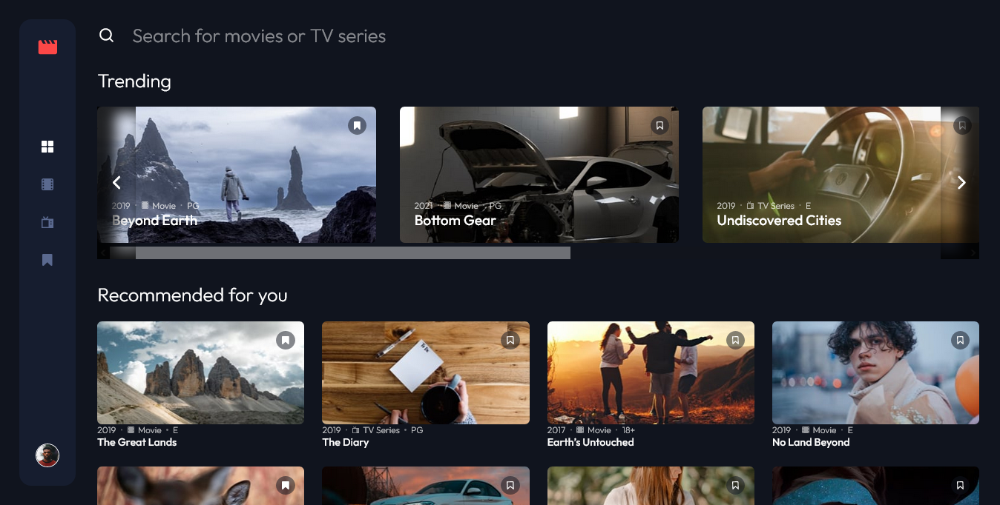

# Entertainment web

This is a solution to the [Entertainment web app challenge on Frontend Mentor](https://www.frontendmentor.io/challenges/entertainment-web-app-J-UhgAW1X). Frontend Mentor challenges help you improve your coding skills by building realistic project.

## Table of contents

- [Overview](#overview)
  - [The challenge](#the-challenge)
  - [Screenshot](#screenshot)
  - [Links](#links)
- [My process](#my-process)
  - [Built with](#built-with)
  - [What I learned](#what-i-learned)
- [Author](#author)

## Overview

### The challenge

Users should be able to:

- View the optimal layout for the app depending on their device's screen size
- See hover states for all interactive elements on the page
- Navigate between Home, Movies, TV Series, and Bookmarked Shows pages
- Add/Remove bookmarks from all movies and TV series
- Search for relevant shows on all pages
- **Bonus**: Build this project as a full-stack application
- **Bonus**: If you're building a full-stack app, we provide authentication screen (sign-up/login) designs if you'd like to create an auth flow

### Screenshot

### Links

- Solution URL: [https://entertainment-web.vercel.app/](https://entertainment-web.vercel.app/)
- Live Site URL: [Add live site URL here](https://your-live-site-url.com)

### Built with

- Typecsript
- [Next.js](https://nextjs.org/) - React framework
- [Styled Components](https://styled-components.com/) - For styles
- Mongodb - The database

### What I learned

This was the first time I used typescript with Nextjs and also the first time I directly used mongodb with Nextjs.

## Author

- Website - [Leonard Ikeh](https://leonardikeh.netlify.app/)
- Frontend Mentor - [@leoikeh99](https://www.frontendmentor.io/profile/leoikeh99)
- Twitter - [@wazza_dev](https://www.twitter.com/wazza_dev)
